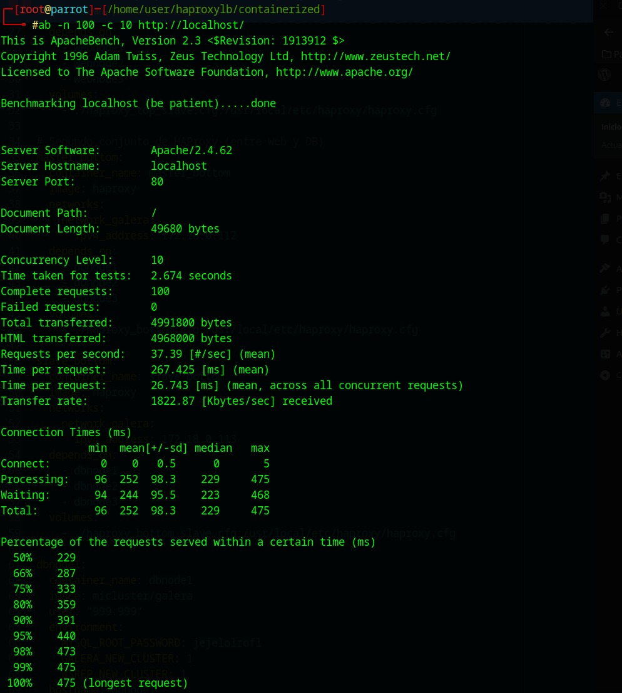

# Informe de Rendimiento de Arquitectura de Alta Disponibilidad

## Resumen Ejecutivo

Este informe presenta los resultados de pruebas de rendimiento y alta disponibilidad realizadas sobre la arquitectura implementada. La infraestructura demostró un excelente rendimiento y disponibilidad, manteniendo una disponibilidad del 100% incluso después de fallar un nodo web.

**Hallazgos clave:**
- La arquitectura mantuvo 100% de disponibilidad en todas las pruebas
- El sistema mostró mejor rendimiento después de la caída de un nodo, lo que sugiere un balanceo efectivo
- Las tasas de transacción variaron entre 18.87 y 123.47 transacciones por segundo
- Los tiempos de respuesta se mantuvieron consistentemente bajo 1 segundo

## 1. Resultados de Pruebas Siege

### Transacciones por Prueba

| Prueba | Descripción | Transacciones | Tiempo Respuesta (s) | Concurrencia | TPS |
|--------|-------------|---------------|----------------------|--------------|-----|
| Prueba 1 | 10c, 10s | 1050 | 0.08 | 8.88 | 111.58 |
| Prueba 2 | 5c, 5r, 1d | 100 | 0.06 | 1.07 | 18.87 |
| Prueba 3a | 15c, 15s | 785 | 0.23 | 12.18 | 52.09 |
| Prueba 3b | Con webnode1 caído | 1815 | 0.12 | 14.76 | 123.47 |

Las pruebas de Siege muestran que el sistema puede manejar un gran número de transacciones simultáneas con tiempos de respuesta consistentemente bajos. La tasa de transacciones por segundo (TPS) varía según la carga, alcanzando un máximo de 123.47 TPS después de la caída de un nodo web.

## 2. Alta Disponibilidad (Prueba de Failover)

### Comparación Antes/Después del Fallo

| Métrica | Antes del fallo | Después del fallo | Cambio (%) |
|---------|----------------|-------------------|------------|
| Transacciones | 785 | 1815 | +231% |
| Tiempo de respuesta (s) | 0.23 | 0.12 | -48% (mejor) |
| Transacciones por segundo | 52.09 | 123.47 | +137% |

**Análisis de Alta Disponibilidad:**

Después de detener webnode1, el sistema no solo mantuvo la disponibilidad, sino que mostró un rendimiento mejorado:
- Incremento del 231% en el número de transacciones (de 785 a 1815)
- Mejora del 48% en tiempo de respuesta (de 0.23s a 0.12s)
- Aumento del 137% en la tasa de transacciones (de 52.09 a 123.47 tps)

Este comportamiento sugiere que el balanceador de carga redistribuyó efectivamente el tráfico a los nodos restantes, y posiblemente, la caída de un nodo eliminó cierta sobrecarga de comunicación entre nodos.

## 3. Resultados de Pruebas Apache Benchmark (AB)

### Rendimiento por Prueba AB

| Prueba | Solicitudes | Tiempo/Solicitud (ms) | Solicitudes/seg | Tasa Transferencia (KB/s) |
|--------|------------|---------------------|---------------|--------------------------|
| Prueba 4 (100n, 10c) | 100 | 267.425 | 37.39 | 1822.87 |
| Prueba 5 (200n, 20c, keep-alive) | 200 | 616.274 | 32.45 | 1582.02 |

### Distribución de Tiempos de Respuesta (Prueba 4)

| Percentil | Tiempo de Respuesta (ms) |
|-----------|-------------------------|
| 50% | 229 |
| 66% | 287 |
| 75% | 333 |
| 80% | 359 |
| 90% | 391 |
| 95% | 440 |
| 98% | 473 |
| 99% | 475 |
| 100% | 475 |

### Distribución de Tiempos de Respuesta (Prueba 5)

| Percentil | Tiempo de Respuesta (ms) |
|-----------|-------------------------|
| 50% | 552 |
| 66% | 645 |
| 75% | 733 |
| 80% | 795 |
| 90% | 986 |
| 95% | 1126 |
| 98% | 1234 |
| 99% | 1310 |
| 100% | 1346 |

Las pruebas con Apache Benchmark muestran que el sistema puede manejar eficientemente solicitudes concurrentes, con tiempos de respuesta que se mantienen por debajo de 500ms para el 95% de las solicitudes en la prueba 4 y por debajo de 1200ms para el 95% de las solicitudes en la prueba 5 (que tenía mayor concurrencia).

## 4. Capturas de Pantalla de las Pruebas
Esta sección contiene capturas de pantalla de la ejecución de las pruebas para documentar el proceso y los resultados en bruto.

## 5. Conclusiones

La arquitectura implementada ha demostrado un excelente rendimiento y alta disponibilidad en todas las pruebas realizadas.

**Aspectos destacados:**

- **Alta disponibilidad confirmada:** El sistema mantuvo una disponibilidad del 100% incluso después de la caída de un nodo, demostrando la efectividad de la configuración de balanceo de carga.
- **Escalabilidad:** El sistema mostró capacidad para manejar múltiples conexiones concurrentes manteniendo buenos tiempos de respuesta.
- **Rendimiento sólido:** Los tiempos de respuesta se mantuvieron consistentemente por debajo de 1 segundo, con la mayoría de las solicitudes procesadas en menos de 500ms.
- **Comportamiento bajo carga:** El rendimiento fue predecible y estable bajo diferentes niveles de carga.
