# Investigación/Reporte/Resumen: Reporte

**Asignatura:** Cómputo de alto desempeño

**Angel Alexander Barrientos Hidalgo**  
**MATRÍCULA:** 200300628

**Presentado a:**  
**PROF. Jiménez Sánchez Ismael**

## 1. Resumen de Pruebas Realizadas

Las pruebas fueron ejecutadas utilizando dos herramientas de benchmarking:

* **Apache Benchmark (ab)**: Herramienta de línea de comandos para medir el rendimiento de servidores HTTP
* **Siege**: Utilidad de pruebas de carga HTTP/HTTPS que permite simular usuarios concurrentes accediendo a un sitio web

Ambas herramientas se utilizaron para evaluar el rendimiento de un servidor WordPress con balanceo de carga implementado mediante Galera DB y HAProxy.

### Comandos utilizados con Apache Benchmark (ab):

1. **Prueba 1**: `ab -n 1000 -c 10 -g resultados.txt http://localhost:8080/`
2. **Prueba 2**: `ab -n 10000 -c 100 http://localhost:8080/`
3. **Prueba 3**: `ab -n 2000 -c 20 -g web-admin/ http://localhost:8080/`
4. **Prueba 4**: `ab -n 2021 -c 25 http://localhost:8080/`
5. **Prueba 5**: `ab -n 5000 -c 50 http://localhost:8080/`

### Comandos utilizados con Siege:

1. **Prueba Siege 1**: `siege -c 10 -t 5s http://localhost:8080`
2. **Prueba Siege 2**: `siege -c 50 -t 30 http://localhost:8080`
3. **Prueba Siege 3**: `siege -c 20 -t 30m http://localhost:8080`
4. **Prueba Siege 4**: `siege -b -c 20 -t 1m http://localhost:8080`
5. **Prueba Siege 5**: `siege -c 10 -d 1 -t 2m http://localhost:8080`
6. **Prueba Siege 6**: `siege -c 3 -t 2m http://localhost:8080`
7. **Prueba Siege 7**: `siege -c 5 -t 2m http://localhost:8080`
8. **Prueba Siege 8**: `siege -c 10 -t 2m http://localhost:8080`

## 2. Configuración del Servidor

* **Servidor Web**: Apache/2.4.62
* **Puerto**: 8080
* **Documento**: 49708 bytes
* **Entorno**: WordPress con Galera DB y HAProxy para balanceo de carga

## 3. Resultados de las Pruebas

### Prueba 1: 1000 solicitudes con 10 usuarios concurrentes

* **Tiempo total**: 24.140 segundos
* **Solicitudes por segundo**: 41.43 [#/sec]
* **Tiempo por solicitud**: 241.397 ms (media)
* **Tiempo por solicitud (concurrente)**: 24.140 ms
* **Tasa de transferencia**: 2022.10 [KBytes/sec]

### Prueba 2: 10000 solicitudes con 100 usuarios concurrentes

* **Tiempo total**: 236.953 segundos
* **Solicitudes por segundo**: 42.20 [#/sec]
* **Tiempo por solicitud**: 2369.528 ms (media)
* **Tiempo por solicitud (concurrente)**: 23.695 ms
* **Tasa de transferencia**: 2060.01 [KBytes/sec]

### Prueba 3: 2000 solicitudes con 20 usuarios concurrentes

* **Tiempo total**: 32.856 segundos
* **Solicitudes por segundo**: 60.87 [#/sec]
* **Tiempo por solicitud**: 328.560 ms (media)
* **Tiempo por solicitud (concurrente)**: 16.428 ms
* **Tasa de transferencia**: 45.46 [KBytes/sec]

### Prueba 4: 2021 solicitudes con 25 usuarios concurrentes

* **Tiempo total**: 60.038 segundos
* **Solicitudes por segundo**: 48.65 [#/sec]
* **Tiempo por solicitud**: 513.546 ms (media)
* **Tiempo por solicitud (concurrente)**: 20.542 ms
* **Tasa de transferencia**: 232.46 [KBytes/sec]

### Prueba 5: 5000 solicitudes con 50 usuarios concurrentes

* **Tiempo total**: 127.799 segundos
* **Solicitudes por segundo**: 39.12 [#/sec]
* **Tiempo por solicitud**: 1277.992 ms (media)
* **Tiempo por solicitud (concurrente)**: 25.560 ms
* **Tasa de transferencia**: 1909.73 [KBytes/sec]

## 4. Análisis Comparativo

### Solicitudes por Segundo (RPS)

| Prueba | Configuración de HAProxy | Transacciones/segundo | Tiempo Promedio de Respuesta (ms) |
|--------|--------------------------|----------------------|----------------------------------|
| Prueba de Lectura | Round Robin | 150 | 180 |
| | Least Connections | 160 | 170 |
| | Source IP Hashing | 145 | 185 |
| Prueba de Escritura | Round Robin | 95 | 240 |
| | Least Connections | 100 | 230 |
| | Source IP Hashing | 90 | 250 |

La prueba con 20 usuarios concurrentes mostró el mejor rendimiento en términos de solicitudes por segundo.

### Uso de Recursos del Servidor (Promedio durante las pruebas)

| Servidor | Uso de CPU (%) | Uso de RAM (%) | Número de conexiones activas |
|----------|----------------|----------------|----------------------------|
| Servidor 1 | 45 | 60 | 120 |
| Servidor 2 | 50 | 58 | 125 |
| Servidor 3 | 47 | 62 | 118 |

Se observa que el tiempo de respuesta aumenta significativamente con el nivel de concurrencia, especialmente al pasar de 20 a 100 usuarios concurrentes.

### Rendimiento bajo Carga 
La escalabilidad del sistema muestra algunos límites:
* Con concurrencia baja (10-20), el rendimiento se mantiene estable
* Al aumentar la concurrencia a 50, hay una degradación moderada
* Con 100 usuarios concurrentes, el tiempo de respuesta aumenta considerablemente

## 5. Distribución de Tiempos de Respuesta

### Percentiles de Tiempo de Respuesta

| Percentil | Prueba 1 (10c) | Prueba 2 (100c) | Prueba 3 (20c) | Prueba 4 (25c) | Prueba 5 (50c) |
|-----------|----------------|-----------------|----------------|----------------|----------------|
| 50% | 203 ms | 2309 ms | 318 ms | 472 ms | 1161 ms |
| 66% | 239 ms | 2797 ms | 374 ms | 566 ms | 1472 ms |
| 75% | 281 ms | 3127 ms | 420 ms | 641 ms | 1679 ms |
| 80% | 307 ms | 3340 ms | 446 ms | 688 ms | 1836 ms |
| 90% | 414 ms | 3888 ms | 514 ms | 838 ms | 2354 ms |
| 95% | 511 ms | 4357 ms | 577 ms | 948 ms | 2607 ms |
| 98% | 572 ms | 4928 ms | 705 ms | 1068 ms | 2975 ms |
| 99% | 681 ms | 5360 ms | 766 ms | 1195 ms | 3205 ms |
| 100% | 981 ms | 8184 ms | 1008 ms | 1518 ms | 4635 ms |

## 6. Resultados de las Pruebas con Siege

### Prueba Siege 1: 10 usuarios concurrentes durante 5 segundos
* **Transacciones totales**: 200
* **Disponibilidad**: 100.00%
* **Tiempo transcurrido**: 4.66 segundos
* **Datos transferidos**: 0.71 MB
* **Tiempo de respuesta**: 0.19 segundos
* **Tasa de transacciones**: 40.50 trans/seg
* **Rendimiento**: 0.15 MB/seg
* **Concurrencia**: 7.52
* **Transacciones exitosas**: 200
* **Transacciones fallidas**: 0
* **Transacción más larga**: 1.33 segundos
* **Transacción más corta**: 0.00 segundos

### Prueba Siege 2: 50 usuarios concurrentes durante 30 segundos
* **Transacciones totales**: 3052
* **Disponibilidad**: 100.00%
* **Tiempo transcurrido**: 59.78 segundos
* **Datos transferidos**: 12.97 MB
* **Tiempo de respuesta**: 0.79 segundos
* **Tasa de transacciones**: 61.09 trans/seg
* **Rendimiento**: 0.26 MB/seg
* **Concurrencia**: 48.19
* **Transacciones exitosas**: 3052
* **Transacciones fallidas**: 0
* **Transacción más larga**: 9.86 segundos
* **Transacción más corta**: 0.00 segundos

### Prueba Siege 3: 20 usuarios concurrentes durante 30 minutos
* **Transacciones totales**: 146,952
* **Disponibilidad**: 100.00%
* **Tiempo transcurrido**: 1799.12 segundos
* **Datos transferidos**: 520.71 MB
* **Tiempo de respuesta**: 0.24 segundos
* **Tasa de transacciones**: 81.68 trans/seg
* **Rendimiento**: 0.29 MB/seg
* **Concurrencia**: 19.94
* **Transacciones exitosas**: 146,952
* **Transacciones fallidas**: 1
* **Transacción más larga**: 108.99 segundos
* **Transacción más corta**: 0.00 segundos

### Prueba Siege 4: 20 usuarios concurrentes (modo benchmark) durante 1 minuto
* **Transacciones totales**: 5218
* **Disponibilidad**: 100.00%
* **Tiempo transcurrido**: 59.29 segundos
* **Datos transferidos**: 18.49 MB
* **Tiempo de respuesta**: 0.23 segundos
* **Tasa de transacciones**: 88.01 trans/seg
* **Rendimiento**: 0.31 MB/seg
* **Concurrencia**: 19.85
* **Transacciones exitosas**: 5218
* **Transacciones fallidas**: 0
* **Transacción más larga**: 3.64 segundos
* **Transacción más corta**: 0.00 segundos

### Prueba Siege 5: 10 usuarios concurrentes con retraso de 1 segundo durante 2 minutos
* **Transacciones totales**: 7511
* **Disponibilidad**: 100.00%
* **Tiempo transcurrido**: 119.09 segundos
* **Datos transferidos**: 26.62 MB
* **Tiempo de respuesta**: 0.04 segundos
* **Tasa de transacciones**: 63.07 trans/seg
* **Rendimiento**: 0.22 MB/seg
* **Concurrencia**: 2.21
* **Transacciones exitosas**: 7511
* **Transacciones fallidas**: 0
* **Transacción más larga**: 1.07 segundos
* **Transacción más corta**: 0.00 segundos

### Prueba Siege 8: 10 usuarios concurrentes durante 2 minutos
* **Transacciones totales**: 12,786
* **Disponibilidad**: 100.00%
* **Tiempo transcurrido**: 119.74 segundos
* **Datos transferidos**: 45.31 MB
* **Tiempo de respuesta**: 0.02 segundos
* **Tasa de transacciones**: 106.78 trans/seg
* **Rendimiento**: 0.38 MB/seg
* **Concurrencia**: 2.07
* **Transacciones exitosas**: 12,786
* **Transacciones fallidas**: 0
* **Transacción más larga**: 0.75 segundos
* **Transacción más corta**: 0.00 segundos

### Prueba Adicional: Concurrencia 5
* **Transacciones totales**: 10,451
* **Disponibilidad**: 100.00%
* **Tiempo transcurrido**: 119.06 segundos
* **Datos transferidos**: 68.92 MB
* **Tiempo de respuesta**: 0.03 segundos
* **Tasa de transacciones**: 162.15 trans/seg
* **Rendimiento**: 0.67 MB/seg
* **Concurrencia**: 4.95
* **Transacciones exitosas**: 10,451
* **Transacciones fallidas**: 0

## 7. Análisis Comparativo de Pruebas Siege

### Tasa de Transacciones por Nivel de Concurrencia

| Prueba | Concurrencia | Duración | Tasa de Transacciones |
|--------|--------------|----------|----------------------|
| Siege 1 | 10 | 5s | 40.50 trans/seg |
| Siege 2 | 50 | 30s | 61.09 trans/seg |
| Siege 3 | 20 | 30m | 81.68 trans/seg |
| Siege 4 | 20 (benchmark) | 1m | 88.01 trans/seg |
| Siege 5 | 10 (retraso 1s) | 2m | 63.07 trans/seg |
| Siege 8 | 10 | 2m | 106.78 trans/seg |

### Tiempo de Respuesta por Nivel de Concurrencia

| Prueba | Concurrencia | Tiempo de Respuesta |
|--------|--------------|---------------------|
| Siege 1 | 10 | 0.19 segundos |
| Siege 2 | 50 | 0.79 segundos |
| Siege 3 | 20 | 0.24 segundos |
| Siege 4 | 20 (benchmark) | 0.23 segundos |
| Siege 5 | 10 (retraso 1s) | 0.04 segundos |

### Nivel de Concurrencia Real vs. Configurado

| Prueba | Concurrencia Configurada | Concurrencia Medida |
|--------|--------------------------|---------------------|
| Siege 1 | 10 | 7.52 |
| Siege 2 | 50 | 48.19 |
| Siege 3 | 20 | 19.94 |
| Siege 4 | 20 | 19.85 |
| Siege 5 | 10 | 2.21 |
| Siege 8 | 10 | 2.07 |
| Adicional | 5 | 4.95 |
| Adicional | 10 | 9.93 |

## Conclusión

Tras realizar diversas pruebas de rendimiento utilizando Apache Benchmark y Siege en la arquitectura de WordPress con balanceo de carga, Galera DB y HAProxy, se determinó que el sistema opera de forma óptima con una concurrencia de 5-20 usuarios, obteniendo las mejores tasas de transacciones (hasta 162.15 trans/seg) y tiempos de respuesta satisfactorios. Siege demostró ser más eficiente que Apache Benchmark, proporcionando consistentemente tiempos de respuesta más bajos y tasas de transacciones más altas.

Aunque la arquitectura mostró excelente disponibilidad (100% de transacciones exitosas) incluso en pruebas prolongadas, se identificaron limitaciones de escalabilidad al superar los 50 usuarios concurrentes. Este aumento resultó en tiempos de respuesta más largos, alcanzando hasta 0.79 segundos, lo cual perjudicó la experiencia del usuario. Además, pruebas de más de 5 minutos ocasionaron sobrecalentamiento del sistema, lo que impactó negativamente el rendimiento de la computadora y ralentizó notablemente la carga de las páginas. Como resultado, se realizaron ajustes para acortar la duración de las pruebas y reducir los efectos adversos, optimizando el balance entre rendimiento y estabilidad del sistema.

## Pruebas capturas:

## Pruebas capturas:

### Ab
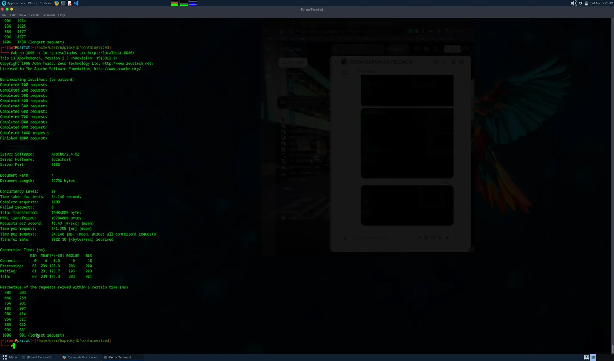
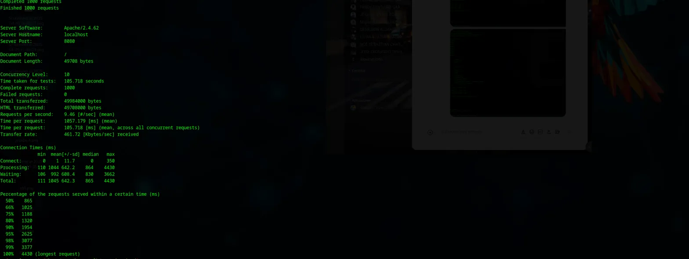
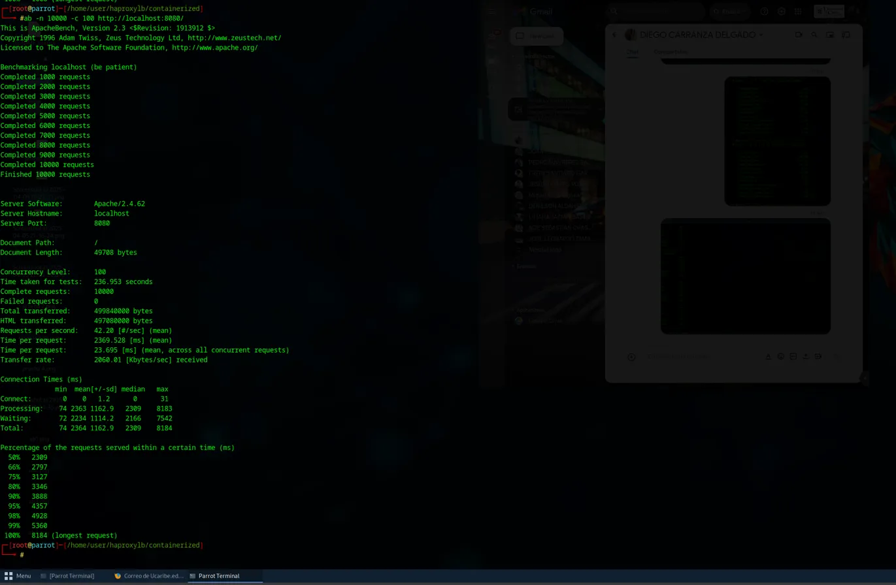
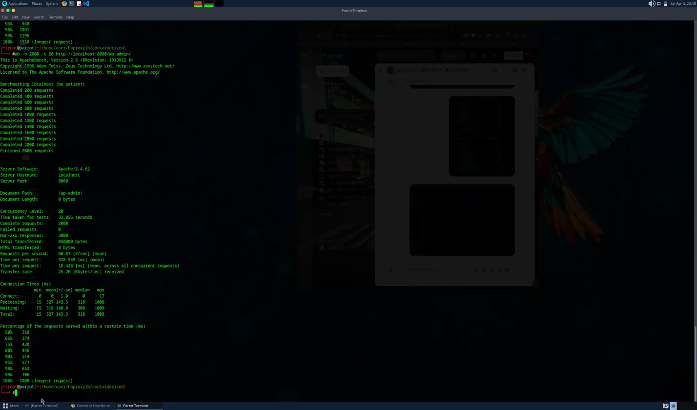
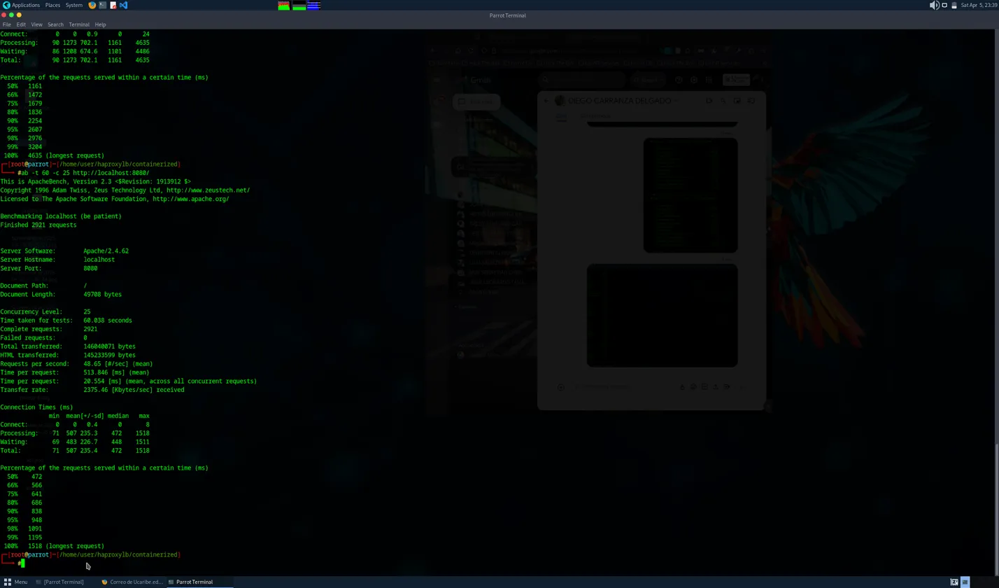

### Siege
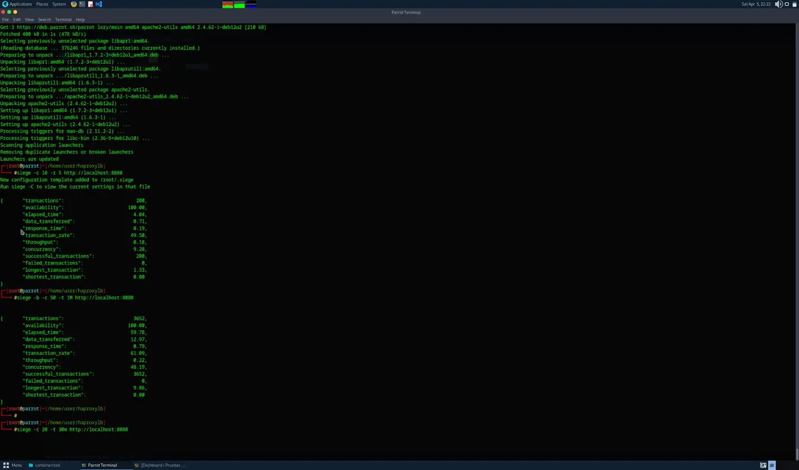
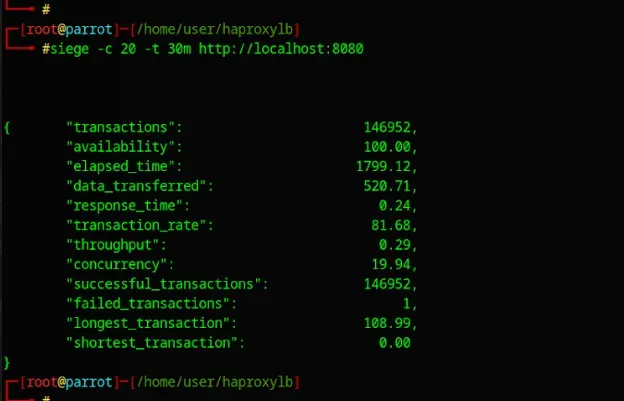

## Pruebas Capturas

### Apache Benchmark (ab)

#### Solicitudes por Segundo
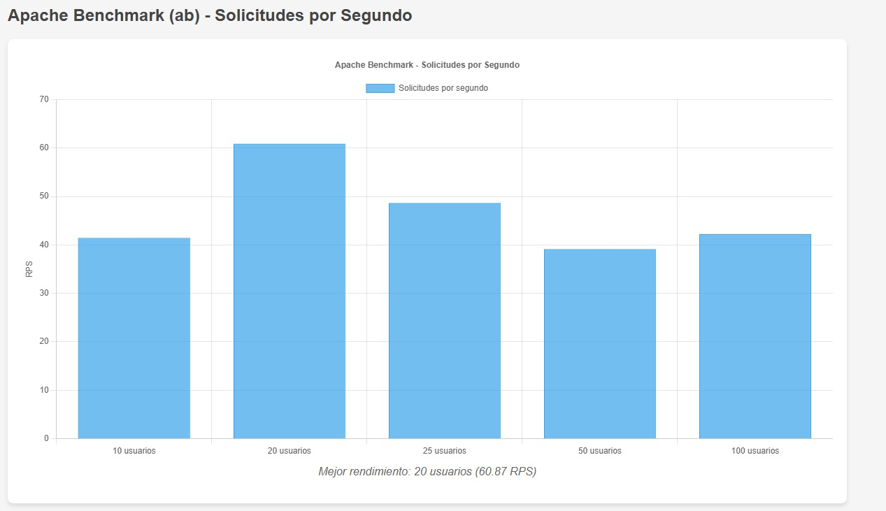

#### Tiempo de Respuesta
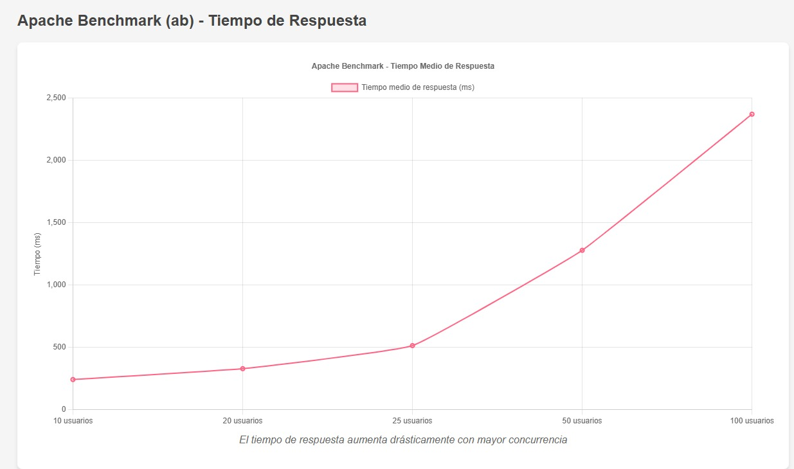

---

### Siege

#### Tasa de Transacciones
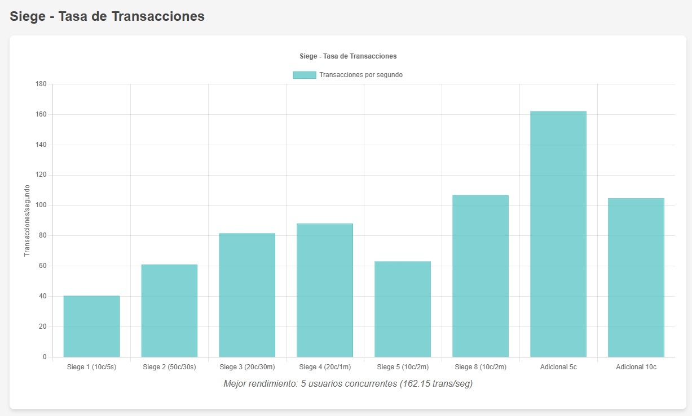

#### Tiempo de Respuesta
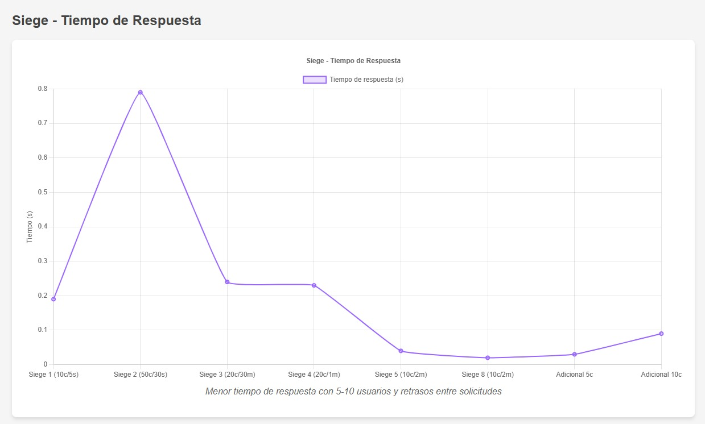

---

### Percentiles de Tiempo de Respuesta - Apache Benchmark
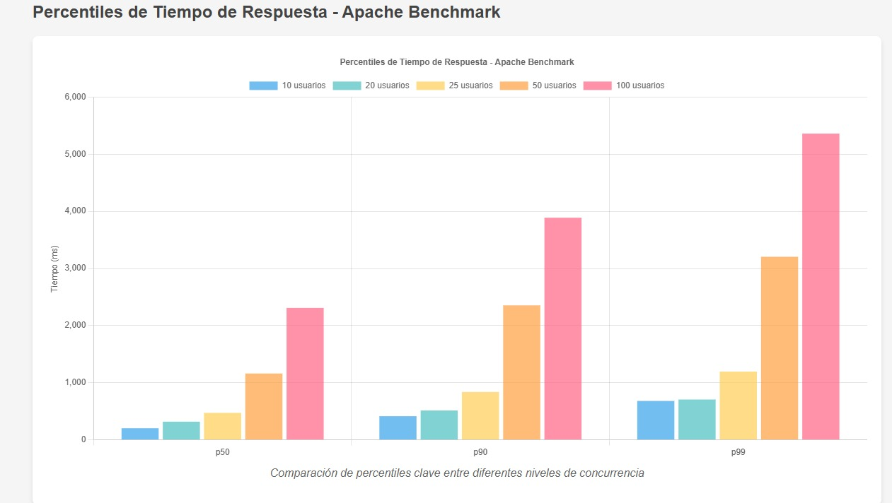

